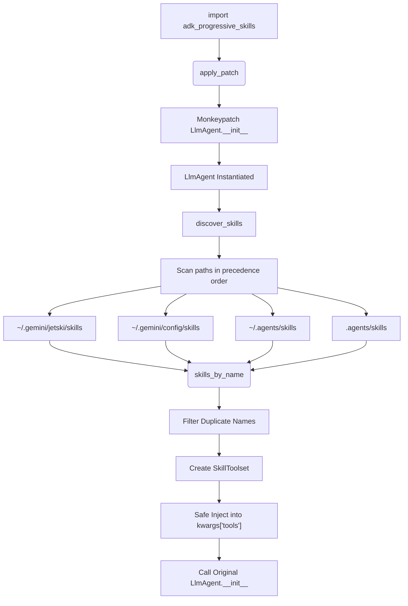
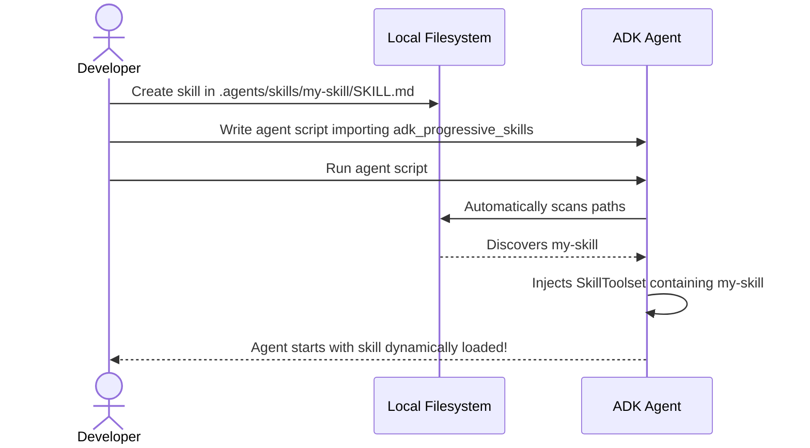

# ADK Progressive Skills

Automate skill discovery and dynamically inject them into your ADK (Agent Development Kit) agents without manual loading or codebase bloat.

## Why This Library Is Important

When building agentic applications using Google’s Agent Development Kit, agents often require specialized knowledge and workflows (skills). Traditionally, skills have to be explicitly loaded and mounted on the agent’s tool list, leading to several drawbacks:
- **Code Coupling**: Agent scripts become coupled to specific skill files, forcing you to modify code whenever you add or modify a skill.
- **Context Bloat**: Hardcoding all skills into a single agent’s tools list wastes context window tokens and model attention.
- **Manual Overhead**: Developers must write verbose boilerplates to manually import, instantiate, and pass skills as tools during agent initialization.

`adk-progressive-skills` solves this by introducing **Progressive Skill Discovery**. By simply importing this library at the top of your agent script, skills are automatically scanned, prioritized by precedence, and seamlessly injected into your agent’s tools on instantiation.

---

## How Progressive Discovery Works

This library automatically hooks (monkeypatches) the ADK agent constructors (`google.adk.agents.llm_agent.LlmAgent` and `google.adk.agents.Agent`). When an agent is initialized:

1. **Precedence-Aware Scanning**: It scans four paths in increasing order of precedence (lowest first, meaning higher precedence paths override duplicate skills from lower ones):
   1. `~/.gemini/jetski/skills` (Global Jetski skills)
   2. `~/.gemini/config/skills` (Global User configuration skills)
   3. `~/.agents/skills` (User home directory skills)
   4. `.agents/skills` (Local workspace directory skills - highest precedence)
2. **Conflict Resolution**: If a skill with the same name exists in multiple search folders, the library keeps only the one from the higher-precedence folder.
3. **Graceful Loading**: If any individual skill folder fails validation or contains errors, the library reports a warning using `warnings.warn` instead of crashing your agent.
4. **Dynamic Toolset Injection**: It packages the discovered skills inside a `SkillToolset` and appends it to the agent’s `tools` parameter, preventing duplicate toolset additions.

---

## Architecture & Workflows

### Architecture/Design



### User Workflow



---

## Usage Instructions

### ADK 1.x Usage

For ADK 1.x style agents, import the progressive skills library at the very top of your entrypoint file:

```python
# 1. Import library first to apply the patches
import adk_progressive_skills

# 2. Import ADK agent classes
from google.adk.agents import Agent

# 3. Instantiate your Agent (skills in .agents/skills/ are automatically loaded)
agent = Agent(
    name="my_helper_agent",
    instruction="Help user with tasks.",
    model="gemini-3.5-flash",
    tools=[], # Injected automatically with SkillToolset
)

print(agent.tools)
```

### ADK 2.0 Usage

For ADK 2.0 style agents, import the library first and use `LlmAgent`:

```python
# 1. Import library first to apply the patches
import adk_progressive_skills

# 2. Import ADK 2.0 agent classes
from google.adk.agents.llm_agent import LlmAgent

# 3. Instantiate your LlmAgent
agent = LlmAgent(
    name="my_helper_agent_v2",
    instruction="Help user with tasks.",
    model="gemini-3.5-flash",
    tools=[], # Injected automatically with SkillToolset
)

print(agent.tools)
```

---

## Context Preservation & Prevention of Context Bloat

To prevent context window bloat and reduce token overhead, the library leverages ADK's native execution-time lazy-loading mechanisms:

1. **Minimal Initial Overhead**: On initialization, the full markdown instructions (`SKILL.md` body) of discovered skills are **withheld** from the initial system instructions. Only the skill **names** and **descriptions** are exposed to the model (either summarized in the system prompt or made queryable via a core `list_skills` tool).
2. **On-Demand Activation**: The model must call `load_skill(skill_name="...")` to fetch the full markdown body of a skill and append it to the conversation history dynamically.
3. **Lazy Tool Mounting**: Any supplementary tools defined in the skill's metadata (`adk_additional_tools` in the YAML frontmatter) are only registered and exposed to the model *after* the skill has been dynamically activated in that session.
4. **On-Demand Resource Access**: Scripts and assets under `scripts/`, `references/`, and `resources/` are accessed progressively using `load_skill_resource()` and `run_skill_script()` only when invoked.

